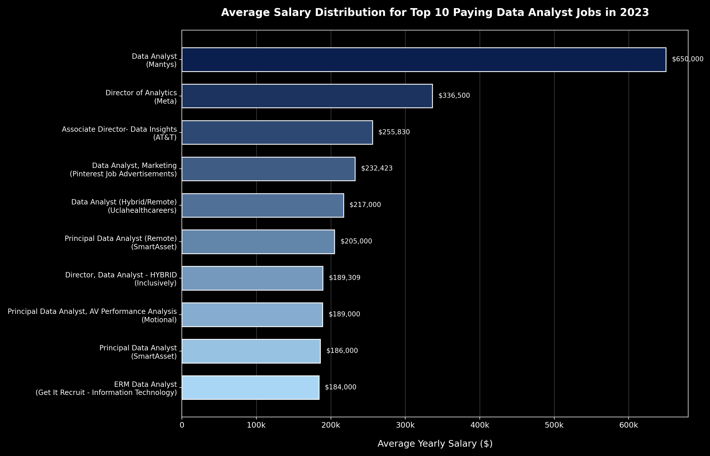
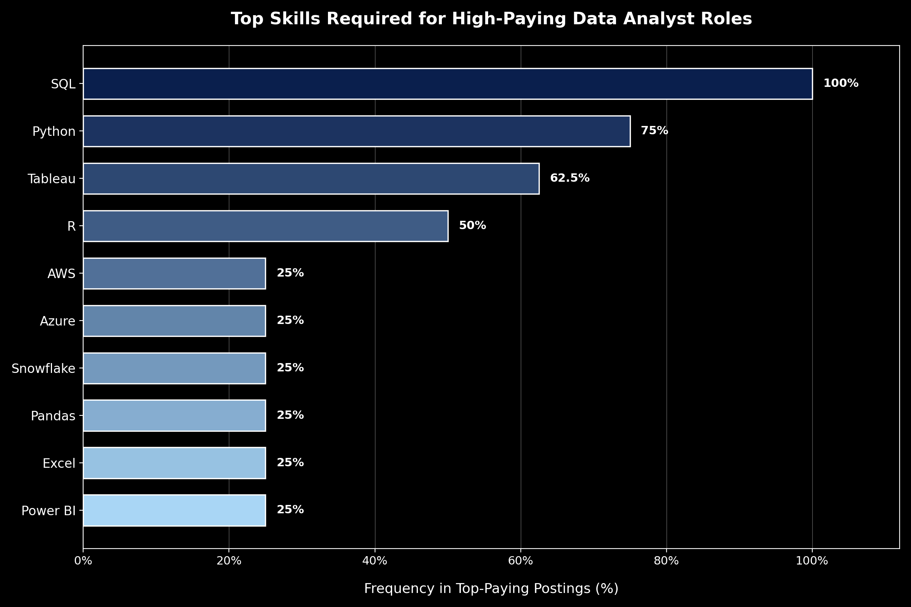

# Introduction
📊 An exploratory data analysis focusing on data analyst roles to uncover top-paying jobs, high-demand technical skills, and optimal salary-to-demand intersections.

🔍 SQL queries? Check them out here: [project_sql folder](/project_sql/)
# Background

Driven by the need to navigate the data job market effectively, this project was created to analyze Data Analyst job postings to identify top-paying roles, key requested skills, and optimal technical competencies. 

By analyzing thousands of postings, this project aims to answer critical questions for job seekers and analysts looking to maximize their market value:

- What are the highest-paying Data Analyst roles?
- Which skills are most frequently requested by employers?
- Which skills yield the highest average annual salaries?
- What are the optimal skills to learn that offer both high demand and strong financial compensation?

Through querying job market data, this analysis provides data-driven answers to guide skill development and career planning in data analytics.
# Tools Used

To analyze the job market data efficiently, I utilized the following tech stack:

* **SQL:** Formulated complex queries, aggregations, and CTEs to extract actionable insights.
* **PostgreSQL:** Served as the relational database management system for storing and querying multi-table job posting datasets.
* **Visual Studio Code:** Used as the primary IDE along with SQL extensions to write, test, and manage database scripts.
* **Git & GitHub:** Managed version control and hosted the repository to showcase project documentation and query workflows.
# The Analysis
Each query for this project aimed at investigating specific aspects of the data analyst job market. Here’s how I approached each question:
### 1. Top Paying Data Analyst Jobs
To isolate the highest-paying opportunities, I filtered remote Data Analyst postings by average annual salary, excluding null values. This query reveals top compensation packages and the specific companies offering them.
```sql
SELECT
    job_id,
    job_title,
    job_location,
    job_schedule_type,
    salary_year_avg,
    job_posted_date,
    name AS company_name
FROM
    job_postings_fact
LEFT JOIN company_dim ON job_postings_fact.company_id = company_dim.company_id
WHERE 
    job_title_short = 'Data Analyst' AND
    job_location = 'Anywhere' AND
    salary_year_avg IS NOT NULL
ORDER BY
    salary_year_avg DESC
LIMIT 10
```
#### Key Insights from Top-Paying Roles

* **Wide Salary Range:** Compensation for the top 10 positions spans from **$184,000 to $650,000**, highlighting significant earning potential for specialized roles.
* **Diverse Employers:** Leading tech firms (Meta), telecommunications giants (AT&T), and financial platforms (SmartAsset) actively compete for high-level analytical talent.
* **Job Title Variety:** Roles range from individual contributor positions (*Data Analyst*) to leadership positions (*Director of Analytics*), showing clear pathways for career growth.

*Bar graph visualizing the salary for the top 10 salaries for data analysts; ChatGPT generated this graph from my SQL query results*
### 2. Required Skills for High-Paying Roles
To determine the key technical requirements of top-tier positions, I joined high-salary job postings with detailed skill data. This reveals the specific toolsets and capabilities employers prioritize when offering premium compensation.
```sql
WITH top_paying_jobs AS (
    SELECT
        job_id,
        job_title,
        salary_year_avg,
        name AS company_name
    FROM
        job_postings_fact
    LEFT JOIN company_dim ON job_postings_fact.company_id = company_dim.company_id
    WHERE 
        job_title_short = 'Data Analyst' AND
        job_location = 'Anywhere' AND
        salary_year_avg IS NOT NULL
    ORDER BY
        salary_year_avg DESC
    LIMIT 10
)
SELECT 
    top_paying_jobs.*,
    skills
FROM top_paying_jobs
INNER JOIN skills_job_dim ON skills_job_dim.job_id = top_paying_jobs.job_id
INNER JOIN skills_dim ON skills_dim.skill_id = skills_job_dim.skill_id
ORDER BY
    salary_year_avg DESC
```
Here's the breakdown of the skills required for the top-paying data analyst jobs:

- **Core Technical Stack:** **SQL** is mandatory across all top-paying postings, closely followed by **Python**, showing that scripting and database querying are fundamental to high-compensation roles.
- **BI & Visualization:** **Tableau** is the predominant visualization tool required by high-paying employers, appearing significantly more often than other BI software.
- **Cloud & Big Data:** Technologies like **Snowflake**, **AWS**, **Azure**, and **Databricks** are frequently cited, indicating that modern data architecture skills correlate with premium salaries.

*Bar graph visualizing the count of skills for the top 10 paying jobs for data analysts; Claude and Gemini generated this graph from my SQL query results*
### 3. Most In-Demand Skills for Data Analysts
To understand market-wide hiring trends, I aggregated the total count of skill mentions across all Data Analyst job postings. This highlights the foundational tools and technologies most requested by employers overall.
```sql
SELECT 
    skills,
    COUNT(skills_job_dim.job_id) AS skill_count
FROM job_postings_fact
INNER JOIN skills_job_dim ON job_postings_fact.job_id = skills_job_dim.job_id
INNER JOIN skills_dim ON skills_dim.skill_id = skills_job_dim.skill_id
WHERE job_postings_fact.job_title_short = 'Data Analyst' 
GROUP BY 
    skills
ORDER BY
    skill_count DESC
LIMIT 5
```
Here's the breakdown of the most demanded skills for remote data analysts in 2023:

- **SQL and Excel** remain fundamental, leading remote positions with **7,291** and **4,611** mentions respectively, underscoring the necessity of core data querying and spreadsheet skills.
- **Programming and Visualization Tools** like **Python (4,330)**, **Tableau (3,745)**, and **Power BI (2,609)** are essential for automated data processing, advanced analytics, and interactive dashboard creation.

| Skills | Demand Count |
| :--- | :--- |
| SQL | 7,291 |
| Excel | 4,611 |
| Python | 4,330 |
| Tableau | 3,745 |
| Power BI | 2,609 |

*Table of the demand for the top 5 skills in remote data analyst job postings*

### 4. Skills Based on Salary
Exploring the average salaries associated with different skills revealed which skills are the highest paying.

```sql
SELECT 
    skills,
    ROUND(AVG(salary_year_avg), 0) AS avg_salary
FROM job_postings_fact
INNER JOIN skills_job_dim ON job_postings_fact.job_id = skills_job_dim.job_id
INNER JOIN skills_dim ON skills_dim.skill_id = skills_job_dim.skill_id
WHERE job_title_short = 'Data Analyst' AND
    salary_year_avg IS NOT NULL
GROUP BY
    skills
ORDER BY
    avg_salary DESC
LIMIT 25
```
Here's the breakdown of the highest-paying skills for data analysts:

- **High Demand for Big Data & ML Skills**: Top salaries are commanded by analysts skilled in big data technologies (PySpark, Couchbase), machine learning tools (DataRobot, Jupyter), and core Python libraries (Pandas, NumPy), reflecting the industry's high valuation of data processing and predictive modeling capabilities.  

- **Software Development & Deployment Proficiency**: Knowledge in development and deployment tools (Bitbucket, GitLab, Kubernetes, Airflow) indicates a lucrative crossover between data analysis and engineering, with a premium on skills that facilitate automation and efficient data pipeline management.  

- **Cloud Computing Expertise**: Familiarity with cloud and data engineering tools (Elasticsearch, Databricks, GCP) underscores the growing importance of cloud-based analytics environments, suggesting that cloud proficiency significantly boosts earning potential in data analytics.

| Skills | Average Salary ($) |
| :--- | :--- |
| PySpark | 208,172 |
| Bitbucket | 189,155 |
| Couchbase | 160,515 |
| Watson | 160,515 |
| DataRobot | 155,486 |
| GitLab | 154,500 |
| Swift | 153,750 |
| Jupyter | 152,777 |
| Pandas | 151,821 |
| Elasticsearch | 145,000 |

*Table of the average yearly salary for the top 10 paying skills for data analysts*
### 5. Most Optimal Skills to Learn

Combining high demand with competitive average salaries pinpoints the most strategic skills for Data Analysts to target for career growth and maximum ROI.

```sql
WITH skills_demand AS (
    SELECT 
        skills,
        skills_dim.skill_id,
        COUNT(skills_job_dim.job_id) AS demand_count
    FROM job_postings_fact
    INNER JOIN skills_job_dim ON job_postings_fact.job_id = skills_job_dim.job_id
    INNER JOIN skills_dim ON skills_dim.skill_id = skills_job_dim.skill_id
    WHERE 
        job_postings_fact.job_title_short = 'Data Analyst'AND
        salary_year_avg IS NOT NULL
    GROUP BY 
        skills_dim.skill_id
), average_salary AS (
    SELECT 
        skills_dim.skill_id,
        ROUND(AVG(salary_year_avg), 0) AS avg_salary
    FROM job_postings_fact
    INNER JOIN skills_job_dim ON job_postings_fact.job_id = skills_job_dim.job_id
    INNER JOIN skills_dim ON skills_dim.skill_id = skills_job_dim.skill_id
    WHERE job_title_short = 'Data Analyst' AND
        salary_year_avg IS NOT NULL
    GROUP BY
        skills_dim.skill_id
)
SELECT 
    skills_demand.skill_id,
    skills_demand.skills,
    demand_count,
    avg_salary
FROM 
    skills_demand
INNER JOIN average_salary ON skills_demand.skill_id = average_salary.skill_id
WHERE 
    demand_count > 10
ORDER BY
    avg_salary DESC,
    demand_count DESC
LIMIT 25
```
Here's the breakdown of the most optimal skills to learn:

- **High Value Big Data & Cloud Warehousing:** Technologies like **Snowflake** (241 postings, $111,578 avg salary) and **Spark** (187 postings, $113,002 avg salary) offer the best combination of strong market demand and six-figure salaries.
- **Data Engineering & Workflow Automation:** Cloud ecosystems and orchestration tools such as **Databricks** ($112,881), **Airflow** ($116,387), and **GCP** ($113,065) provide clear pathways to high-paying analytical engineering positions.
- **Specialized ML Frameworks:** Deep learning tools like **PyTorch** ($125,226) and **TensorFlow** ($120,647), alongside real-time data streaming platforms like **Kafka** ($129,999), yield top-tier compensation despite a slightly lower volume of total job listings.

| Skill ID | Skill | Demand Count | Average Salary ($) |
| :--- | :--- | :--- | :--- |
| 98 | Kafka | 40 | 129,999 |
| 101 | PyTorch | 20 | 125,226 |
| 31 | Perl | 20 | 124,686 |
| 99 | TensorFlow | 24 | 120,647 |
| 63 | Cassandra | 11 | 118,407 |
| 219 | Atlassian | 15 | 117,966 |
| 96 | Airflow | 71 | 116,387 |
| 3 | Scala | 59 | 115,480 |
| 169 | Linux | 58 | 114,883 |
| 234 | Confluence | 62 | 114,153 |

# What I Learned

Throughout this project, I advanced my SQL querying capabilities and gained real-world experience in translating raw database records into strategic career insights. Here is a summary of the technical skills and analytical methodologies I developed:

* **Advanced SQL Querying & CTEs:** Mastered Common Table Expressions (`WITH` clauses) to modularize complex logic, enabling multi-stage calculations such as combining skill demand counts with average salary metrics seamlessly.
* **Complex Data Aggregations:** Utilized `GROUP BY`, `COUNT()`, and `AVG()` functions alongside `ROUND()` to compute aggregated market statistics and surface salary benchmarks across thousands of job postings.
* **Multi-Table Relational Joins:** Successfully linked core data models (`job_postings_fact`, `skills_job_dim`, and `skills_dim`) using `INNER JOIN` statements to connect broad job market attributes with specific skill dimensions.
* **Data Filtering & Quality Control:** Applied strict filtering conditions (`WHERE`, `IS NOT NULL`, and boolean flags) to exclude incomplete salary listings and focus specifically on remote Data Analyst roles.
* **Data-Driven Strategic Analysis:** Developed a mindset for balancing supply and demand by evaluating both raw skill popularity and financial compensation to identify high-value technical investments.
# Conclusions

### Insights

1. **Top-Paying Data Analyst Jobs**: Remote Data Analyst roles show significant compensation potential, with top-tier positions reaching average yearly salaries as high as $650,000.
2. **Skills for Top-Paying Jobs**: High-paying roles heavily prioritize SQL proficiency alongside Python and visualization tools, confirming that deep technical querying is foundational for securing top salaries.
3. **Most In-Demand Skills**: SQL dominates overall job market volume (leading with over 7,200 remote job postings), followed closely by Excel and Python, making them essential baseline tools for any job seeker.
4. **Skills with Higher Salaries**: Advanced Big Data and Machine Learning technologies—such as PySpark ($208k avg), Bitbucket, and DataRobot—command the highest average salaries, demonstrating a strong market premium on specialized data engineering and predictive modeling skills.
5. **Optimal Skills for Job Market Value**: Cloud warehousing and pipeline tools like Snowflake, Databricks, and Airflow balance high demand with six-figure average salaries, representing the most strategic investment areas for data analysts looking to maximize career growth.
### Closing Thoughts

This project significantly strengthened my advanced SQL query-building capabilities—specifically utilizing CTEs, multi-table joins, and data aggregations in PostgreSQL—while uncovering actionable insights into the Data Analyst job market. 

The findings serve as a practical roadmap for prioritizing high-ROI skills, demonstrating that pairing foundational tools like SQL and Python with cloud technologies like Snowflake and Databricks drastically increases market value. Building this analysis reinforced the importance of using data-driven decision-making to navigate evolving hiring trends in analytics.
# 🤝 Acknowledgements
* Project layout and analytical focus inspired by [Luke Barousse](https://www.youtube.com/@LukeBarousse).